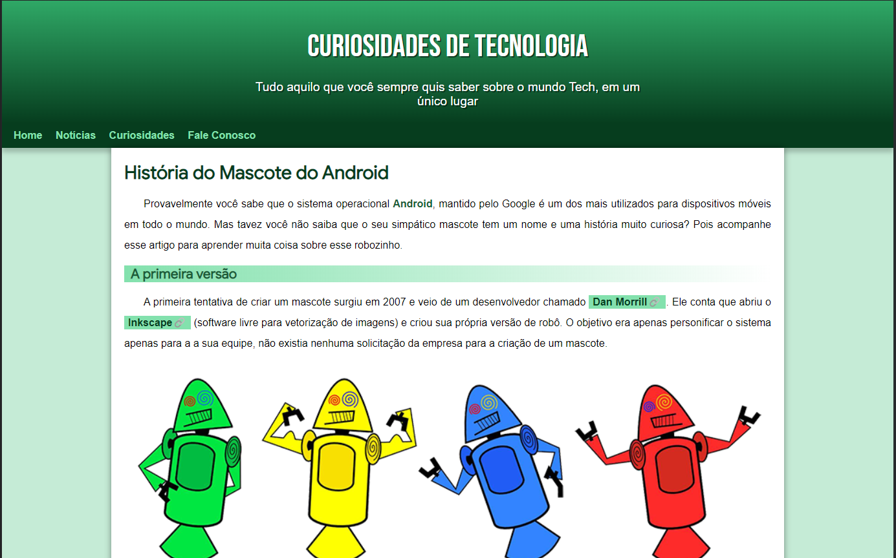

<h1>Boas vindas ao repositório do mini-projeto Android.</h1>

  
Este é um simples projeto desenvolvido no curso <strong>HTML5 e CSS3</strong> em Dezembro de 2021, pela plataforma <a href="https://www.cursoemvideo.com/" target="_blank"><i>Curso em Vídeo</i><a/>.

  
O desafio consiste em uma aplicação simples com uso de responsividade.

<h2>Stacks Utilizadas:<h2> 

  
  

  <h3>Pré-visualização</h3>
  <a href="https://vmedeiros-projeto-android.vercel.app/" target="_blank">Confira aqui a aplicação</a>
  

     
  

